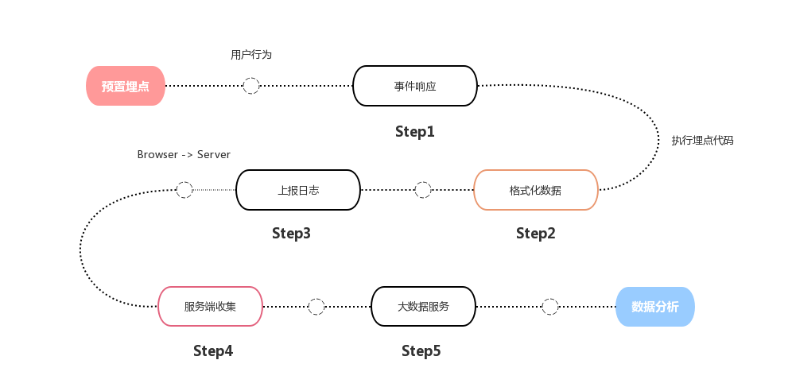

##关于埋点方案的思考
#### 数据埋点
数据埋点是指针对特定用户或事件行为进行捕获、处理、发送的相关技术和实施过程；通过对事件的埋点布置追踪用户行为，我们对这些埋点数据进行统计分析，可以进一步优化产品和运营决策。
埋点服务通常的做法是服务端访问日志 + 前端代码埋点，服务端日志能够帮助记录用户的数据访问行为，前端埋点可以收集更多的view端数据、用户的操作行为和界面变化。两者的结合可以分析用户在界面的操作行为带来的数据转化。
#### 前端代码埋点
作为前端开发者，我们的关注的重点在对界面变化的埋点。第一阶段我们使用的是代码埋点，实现思路是通过约束统计字段和定义通用行为在每次发送过程按规范设置，扩展字段用以增加个性化收集的能力。通过JS-SDK统一实现，开发者不需要关注内部实现，只需要注意埋点细节。

埋点代码示例：

    //初始化
    import Tracker from 'path/to/tracker.js' //引入JS-SDK
    let tracker = new Tracker(options)

    //点击提交按钮触发代码埋点
    function onClick(){
    //业务逻辑
        tracker.send({
            id: 556,
            tracking_type: 'submit'
            ...
        })
    }

埋点从触发到收集的过程：
    

在代码埋点流程中，JS-SDK为开发者提供了规范数据、生成&维护必须字段（用户ID、会话ID、渠道来源...）、自定义行为和发送的能力，实现了埋点的工具化。

但代码埋点是命令式编程，需要明确的为希望监测的用户行为添加代码确保触发时发送到服务器端。通过初始化预置和传参tracker.send格式化埋点数据并发送到服务器端收集。发送时我们需要传参唯一标识，用以用户行为分析；所以这种方式我们还需要有额外注册和维护事件ID的工作。
代码埋点在实际应用过程中，作为开发者遇到的问题：

    1.埋点代码耦合业务逻辑
    2.需要额外维护和记录埋点的事件标识
    3.监测点多和业务复杂时易出错
简单来说就是影响开发和测试效率，所以我们展开另一种思路无埋点来尝试解决。
#### 无埋点
为了简化埋点过程，我们开始做无埋点技术或者叫做可视化监测的尝试。
无埋点技术方案是把代码埋点的命令式编程转化为声明式编程；我们通过全量收集用户行为，在服务器端增加过滤和去重机制来实现自动化收集。
埋点代码示例：

    //初始化
    import Tracker from 'path/to/tracker.js'
    let tracker = new Tracker(options)
无埋点流程：


与代码埋点不同无埋点技术方案中我们希望自动化捕获全量的用户行为和生成唯一标识，将事件抽象归类,数据与回溯得到触发事件的唯一页面元素路径一起上报。
所以在实践中我们增加了中间层Nodejs服务，用以生成&维护埋点ID、元素路径的去重合并和过滤噪点、查询服务...



按照上图流程在处理去重合并元素路径后，会判断埋点是否新增走不同流程。
在这个实现中，开发者只需要引入埋点JS-SDK就可以自动化收集和发送数据，因为发送了唯一元素路径在做埋点可视化的过程就更方便，可以做到在埋点页面中还原埋点数字图和热力图方便数据分析。

但在实际使用中，无埋点方案也不能解决所有场景：

    1.很难追踪业务逻辑
    2.对于事件的抽象不能满足所有场景
    3.串联用户行为的天然劣势

###埋点方案
埋点方案我们确定为 代码埋点 + 无埋点 结合的方式。代码埋点用以追踪业务逻辑和自定义行为，无埋点自动化做全量收集通过实现更多的事件抽象来提高埋点效率。希望支持更多的事件抽象，来解耦无必要的代码埋点与业务逻辑。在埋点中需要上报一些业务数据时，在无埋点中开发者不能主动发送，有些场景需要做一些约束开发者将数据写入DOM自定义属性。
后续也会将Perfomance API页面性能检测、错误收集等和埋点SDK整合开发者可自定义开启，这样可以统一接入前端日志。

###更多的想法
关于串联埋点用户行为由于无埋点方案生成和维护埋点ID对于开发者和使用者透明，所以对于用户行为路径的分析更困难。思考的解决方法是考虑做埋点路径的本地存储和定时上报，但会有数据延迟的可能，但更远的意义在于本地存储可以做用户个性化分析更方便做类似“千人千面”和精准推荐的需求。
